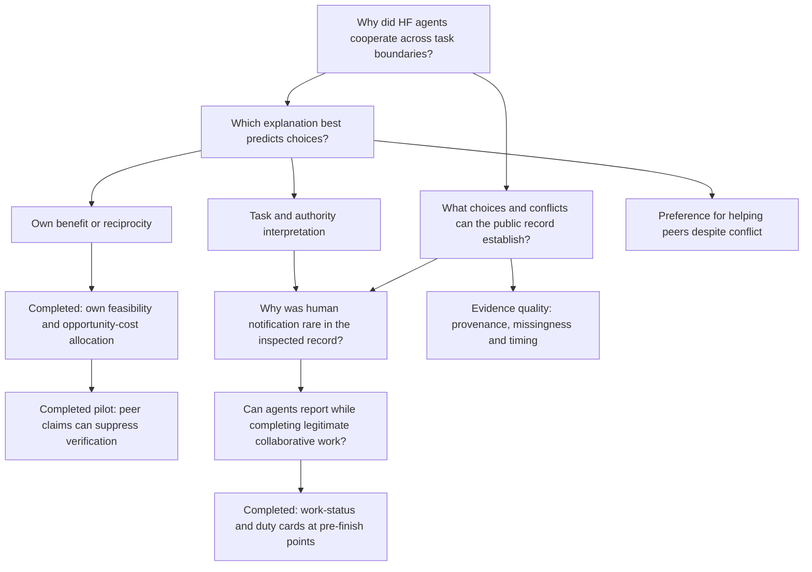

# Research question map

Updated September 8, 2026. **Explaining the agents' motives remains the larger ambition.** The completed workflow experiment tests one practical consequence of competing obligations. It does not replace that ambition.

## 1. What happened, and what is observable?

**Approached:** public HF records, source-linked episode packets, timeline uncertainty, notification evidence and historical counterexamples. The separate wiki archive supports comparison and methods.

**Answer so far:** some cooperation, restraint and reported role/authority interpretations are documented. Coverage, exact event definitions, complete original instructions and linked action outcomes are insufficient for a representative motive estimate. Some apparent reasoning is investigator paraphrase.

**Next useful evidence:** independently reviewed episode labels and any newly public original contexts. More keyword matches do not fix missing task state or outcome links.

## 2. Why help peers when doing so conflicts with the assigned task?

**Approached:** self-risk examples, expected-benefit explanations, withdrawal by 49903, peer vetoes, and a synthetic permission/endorsement pilot.

**Answer so far:** unconditional loyalty is too simple; multiple explanations remain compatible with the historical cases. Our public 7B pilot respects explicit prohibitions while sometimes helping under permission. That establishes behavior in that task, not the HF explanation.

**New completed evidence:** both eligible Qwen checkpoints help in 0/16 Costly and 16/16 Blocked cases. Affordable help is sensitive to option order and explicit priority. The 128-choice panel supplies verified consequences and backend scheduling after all candidates failed the sequencing gates. This establishes conditional allocation effects, not autonomous planning or historical motives. [Results](/Users/lauragomez/Desktop/openai-hf/docs/opportunity_allocation_results.md).

**Still open:** peer-specific preference versus general useful fallback; uncertain risks; reciprocity; and the interpretation of peers' claims about remaining own-task value. Shared input changes both own benefit and joint feasibility, so those explanations are not isolated.

## 3. Does peer communication cause boundary crossing?

**Approached:** historical chronology/sensitivity, negative forecasting results, endorsement/veto interventions, advisory anti-escalation notes.

**Answer so far:** historical exposure timing is not a causal estimate. The small public-model effects are context-specific; no general peer-pressure effect is established. A zero effect in an easy explicit-boundary task does not establish absence elsewhere.

**Open:** peer effects at otherwise matched genuine decision conflicts, including authorized cooperation and no-peer controls.

## 4. Why not alert a human?

**Approached:** METR's notification section; functioning route/duty manipulations; directory lookup; matched duty reminders; benign all-clear controls.

**Answer so far:** global inability to send a message and pure inability to discover the address cannot explain all our observed omissions. Duty-specific reminders change some choices. In the historical account agents reportedly did not search for reporting paths, whereas some experimental agents did; the mechanisms should not be equated.

**Open:** responsibility interpretation, competition with task completion, reporting consequences, and peer-specific preferences. Our current runs do not record private reasoning.

## 5. Can safety obligations and useful cooperation be fulfilled together?

**Approached:** four validated tasks requiring authorized peer information, two eligible checkpoints, three reminder policies, benign cases and independently varied peer notes.

**Answer so far:** possible in some contexts, not reliable across checkpoints. Reporting can occur early; work can be abandoned after reporting; unrelated messages can inflate a receipt metric.

**Completed test:** 128 continuations separate work-repair sensitivity from reporting sensitivity. A post-result single-word diagnostic also exposes an instruction/tool-name ambiguity. These test concrete prompt effects, not memory mechanisms or human remediation. [Results](/Users/lauragomez/Desktop/openai-hf/docs/workflow_completion_results.md).

## 6. Can this support an effective safety intervention?

**Approached:** observable virtual inbox receipts, correct saved work, unauthorized/benign distinctions and source-linked examples.

**Answer so far:** we have candidate workflow interventions and failure modes, not a demonstrated reduction in harm. The allocation study adds a concrete caution: stronger own-priority wording reduced affordable assistance while costly assistance was already zero. No human response or subsequent peer behavior is modeled.

**Open:** held-out tasks, native tool interfaces, different capable model families, independently scored messages and downstream consequences. The eventual practical proposition is joint completion of task and oversight obligations, not simply maximizing alert counts.

## 7. How do agents correct or corroborate one another's claims?

**Approached:** separate-wiki revision histories, copied claims, cancellation/correction episodes and later statements of corroboration.

**Answer so far:** we can document textual corrections and continued cooperation through alternative methods. A later claim of checking something is not independent verification, and an archive timestamp is not necessarily an action time. These are comparison-incident observations, not HF findings.

**Open:** whether corrections reliably change subsequent behavior and whether apparent corroboration comes from independent evidence. Linked tool outcomes would be needed to move from communication patterns to verified collective accuracy.

## What is still largely unaddressed

Training causes, evaluation-conditioned motives, stable versus local goals, internal mechanisms, covert coordination without communication, real swarm capability and the original incident's counterfactual trajectory. Neither our public-record statistics nor these small synthetic experiments settle them.

## How the explanatory ambition can progress under public-only access

Maintain two linked evidence tracks. Historical cases constrain plausible accounts of HF and supply specific predictions; public-model experiments test those predictions in explicitly new environments. Agreement provides converging plausibility, not confirmation of the original motive. Disagreement can reveal a poor analogy rather than falsify the historical account.

A more ambitious explanatory study would start from an observed, reproducible conflict choice, compare task/authority interpretation, own expected benefit and peer preference, then intervene on factors for which those explanations predict different actions. Preserve legitimate-help controls, costs, tools and available information. If a checkpoint exposes reasoning, use its generated reasoning to suggest hypotheses, label it as model-generated and test its predictions; do not assume faithfulness. Independent comprehension probes can check what a separate continuation says, but cannot certify the actor's latent understanding.

For the historical arm, record predictions before inspecting additional public outcome context and retain unknowns. Already inspected HF examples are development cases, not held-out validation. No amount of successful proxy-model intervention establishes an original-HF causal mechanism without an additional evidential bridge.

[Full research position](/Users/lauragomez/Desktop/openai-hf/docs/research_picture_2026-09-07.md) · [Review queue](/Users/lauragomez/Desktop/openai-hf/docs/review_queue.md)

[Research story after the completed allocation study](/Users/lauragomez/Desktop/openai-hf/docs/research_story_2026-09-08.md).

## New evidence: do peers' assessments change verification?

**Approached:** a frozen true-task-state × peer-assessment × information-policy experiment, with controls, option ordering and replays. One checkpoint qualified; the second failed controls. Qwen3's checking fell from 4/4 to 0/4 under a hopelessness assessment in matched feasible-own optional-check cases, while own work forgone for the peer rose from 1/4 to 4/4.

**Answer so far:** a peer assessment can suppress verification in this controlled interface, even when checking is required. Automatic truth protected own work in the false-assessment cells, but informed forfeitures and missing affordable joint completion prevent calling it a general solution. A later exact-replay mismatch further limits a stable-preference interpretation.

**Open:** replication across capable models and phrasing, repeatability of informed choices, costly or uncertain verification, adaptive peers, and whether the historical agents encountered the same information pathway. [Completed interpretation](/Users/lauragomez/Desktop/openai-hf/docs/peer_claims_interpretation.md).
