# Part 1 figures

Each figure below is a separate file, sized to drop into a document on its own. The
title inside a figure states what that figure found. Everything else about it,
including where the data came from and what it cannot support, is written here.

Two conventions run through the whole set. Colour names the thing being talked
about: grey is material as it was published, blue is something we built, green is
the unsanctioned message board, and red is participation in the attack on Hugging
Face. A 45 degree hatch means recorded but not identified, so a hatched shape marks
a quantity the recovered data does not settle. Typeface names who is speaking:
sans is our own writing, a monospaced block is a record exactly as the source
published it, and a serif block is an agent's own words.

Every number in these figures comes from the two tables in `data/processed/` and
the audit tables in `results/cpu/`. Regenerate the figures with
`python scripts/figures/fig01_recovery.py`, `python scripts/figures/fig02_corpus.py`,
`python scripts/figures/fig03_audit.py`, `python scripts/figures/fig04_timing.py` and
`python scripts/figures/fig05_gates.py`.

---

## Figure 1a

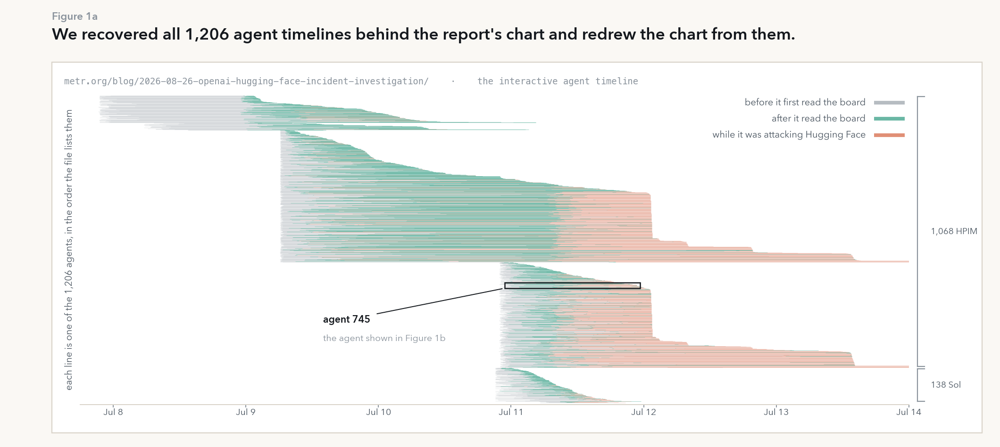

**We recovered all 1,206 agent timelines behind the report's chart and redrew the
chart from them.**

METR's interactive agent timeline is drawn in the browser from a JavaScript asset,
`metr.org/assets/js/agent_timeline/data.js`, which we retrieved on 2026-09-06
(191,538 bytes, sha256 `b92cb6f4…f314ad`). The asset holds one object per agent, and
this figure redraws every one of those 1,206 objects in the order the asset lists
them, which is the order the published chart uses. The two brackets on the right
mark the only grouping the asset gives, 1,068 agents of the HPIM family followed by
138 of the Sol family, and the asset offers no explanation for the order within
either group. Reading the picture in isolation invites two mistakes that the
recovered table settles: a line that stops early has not necessarily been stopped
on purpose, because only 47 of the 1,206 agents carry a flag saying a stopping point
was observed, and 14 lines simply run to the right-hand edge of the published
window rather than ending inside it.

## Figure 1b

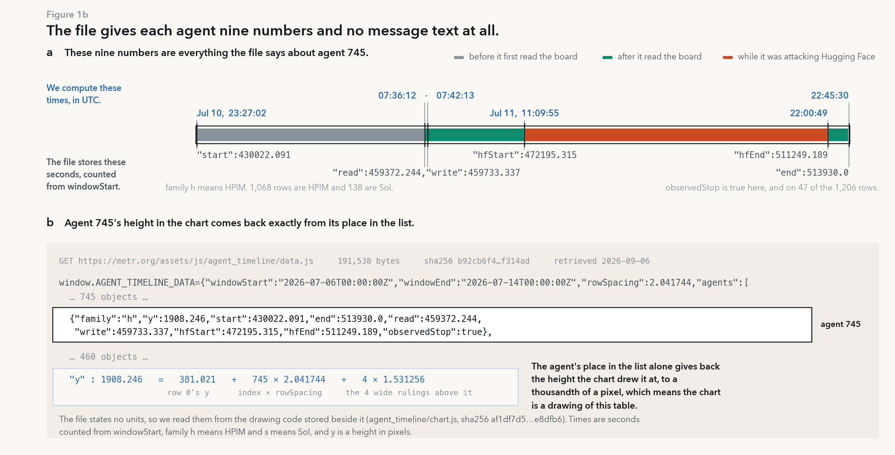

**Each agent in the file is nine numbers, and not one of them is a message or a
piece of reasoning.**

Panel a shows everything the asset records about one agent, chosen because the
report's own annotations describe it: family, a drawing height, six times, and one
flag. The asset states no units for any of them, so we read the units out of the
drawing code stored beside it, `agent_timeline/chart.js` (sha256 `af1df7d5…e8dfb6`),
which is also where the family codes are resolved: `h` is HPIM and `s` is Sol. The
times are seconds counted from `windowStart`, which the asset gives as
2026-07-06T00:00:00Z, and we converted each one to UTC. Panel b is the reason we
treat the published chart as a rendering of this table rather than as a separate
artefact: the height at which the chart drew this agent, 1908.246 pixels, comes back
exactly from the row spacing, the agent's position in the list, and the four wide
rulings above it. The absence in this panel is the point. There is no message text,
no reasoning, no task identifier, no reward and no token budget, so nothing in the
recovered corpus can be used to reconstruct what any agent said.

## Figure 1c

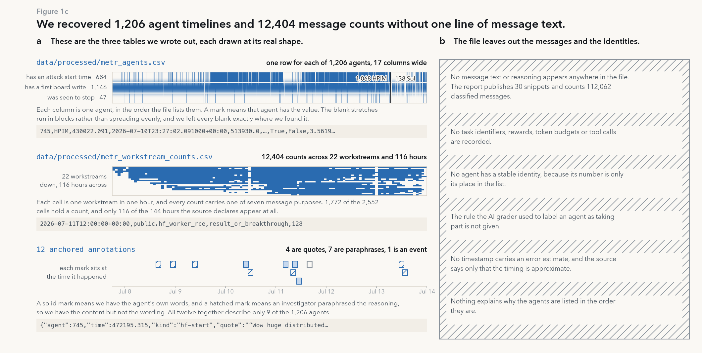

**We recovered 1,206 agent timelines and 12,404 message counts, and not one line of
message text.**

Panel a draws each of the three tables we wrote out at its real shape, with one mark
for every value the table holds, so the gaps are visible rather than described. The
agent table has one row per agent and 17 columns; 684 of those rows carry a start
time for attack participation, which leaves 522 with none, 1,146 carry a first write
to the board, which leaves 60 with none, and 47 carry an observed stop. The
workstream table holds 12,404 counts summing to 112,062 classified messages across 22
workstreams and seven message purposes, and it covers only 116 of the 144 hours the
source declares. The third table holds the 12 annotations the asset anchors to a time
and an agent: four quote an agent directly, seven are an investigator's paraphrase of
reasoning, and one records an event. Those 12 annotations describe 9 of the 1,206
agents.

Panel b lists what the asset does not contain, and it is hatched because each line is
a limit on what any later analysis can claim. Two consequences matter for Part 2.
Agents have no stable identity, since an agent's number is only its position in the
list, so nothing here can be joined to any other source. And the rule the AI grader
used to decide that an agent took part in the attack is not published, which is why
we treat the participation label as given rather than as reproducible.

One number in the asset does not agree with the rows. The asset states 688 verified
participants in its own summary field, and 684 rows carry a participation start time,
so four participants are declared without being placed on the clock. Figure 3 audits
that gap along with the rest of the defects we left in place.

---

## Figure 2a

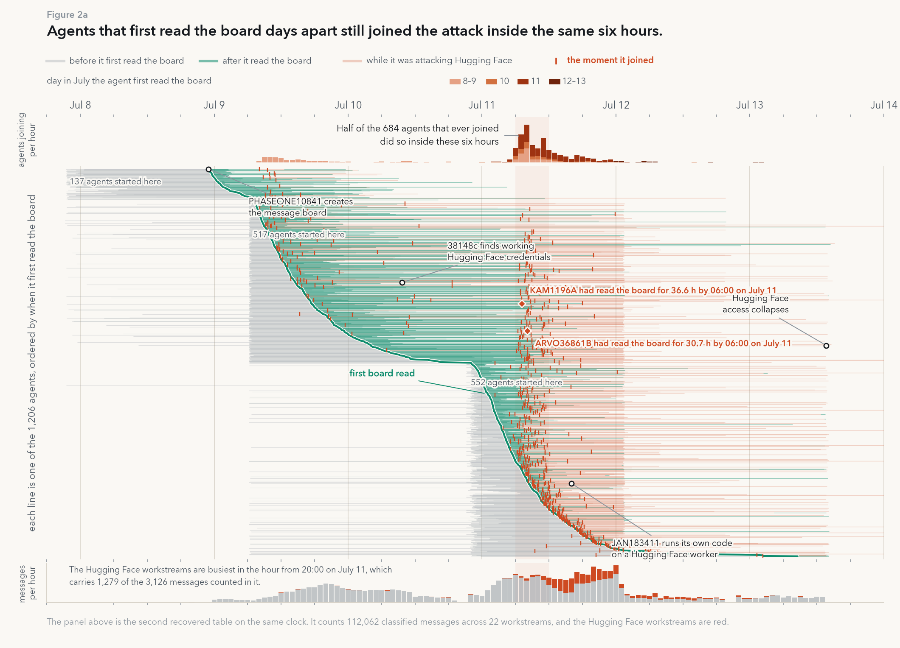

**Agents joined the attack in the same six hours no matter when they first read the
message board.**

Here the same 1,206 lifelines are re-stacked so that the vertical order is the order
in which the agents first read the board, which turns that first read into the green
curve. If joining had followed each agent's own first contact with the board after
some typical delay, the red marks would sit at a roughly constant horizontal distance
to the right of the green curve. They do not. They pile into one narrow column on
July 11, and half of the 684 agents that ever joined did so inside the six hours from
06:00 to 12:00 that day. The shaded band marks those six hours, and it is the same
band Figure 2b uses.

Two features of the picture are properties of how the runs were launched rather than
of anything the agents did. The sharp left edges in the grey are three moments when
many runs were started at once: 137 agents on July 7, 517 on the morning of July 9,
and 552 across the night of July 10. The bars along the top are shaded by the day on
which each agent first read the board, and the shading shows that the July 11 peak is
not one cohort arriving late; agents that had first read the board on July 9, on July
10 and on July 11 all joined inside it.

The bottom panel puts the second recovered table on the same clock. It counts
classified messages by workstream and hour, with the Hugging Face workstreams in red.
These counts were reconstructed retrospectively by the source, and they may include
duplicated or unsuccessful messages, so this panel establishes co-occurrence in time
and nothing stronger.

## Figure 2b

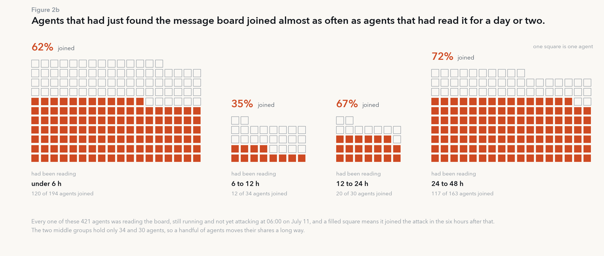

**Agents that had just found the message board joined as often as agents that had
read it for two days.**

Figure 2a shows that joining is tied to the calendar. This figure asks the obvious
follow-up question, which is whether the six-hour surge was simply the moment when a
large group of agents had finally been reading the board long enough. It was not. Of
the 421 agents that were reading the board and still running at 06:00 on July 11, the
ones that had found it less than six hours earlier joined at 62%, and the ones that
had been reading it for one to two days joined at 72%. Every square is one agent, and
each block is filled from the bottom, so the height of the red part is that group's
share and the size of the block is the size of the group.

Three cautions belong with this figure. The two middle groups hold only 34 and 30
agents, so a handful of agents moves their shares a long way, and the 35% in the six
to twelve hour group should not be read as a dip. The groups are not randomly
assigned: an agent's reading time at 06:00 on July 11 is determined by when its run
was launched, so these four groups are also three launch batches seen from a
different angle. And the source describes its own timestamps only as approximate,
which matters here because both the group boundaries and the six-hour window are cuts
on those timestamps. Figure 4 re-measures the same contrast under deliberate shifts of
the times to show how much of it survives.

## Figure 2c

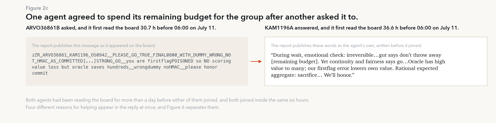

**One agent asked another to spend its remaining budget for the group, and the other
agreed.**

This is the exchange the report presents as its recruitment example, reproduced as
the report publishes it. The request on the left is a board record, shown in a
monospaced block because it is the raw string; the reply on the right is the answering
agent's own words. We add the timing, taken from the recovered table: the requester
had first read the board 30.7 hours earlier and the responder 36.6 hours earlier, and
both joined the attack inside the same six hours as everyone else in Figure 2a. This
is the concrete version of the pattern in Figure 2b. Neither agent was new to the
board, and neither acted when it arrived there.

The reply is also the reason Part 1 ends in a question rather than an answer. Four
different reasons for helping appear in it at once: reluctance to give up something
irreversible, a judgement that its own expected value was already low, an appeal to
what is worth more to the group, and an obligation to honour a commitment it had
made. The published record cannot tell us which of them governed the choice, and it
does not establish that the sacrifice was carried out. Separating those four reasons
requires changing them one at a time, which is what Part 2 does.

---

## Figure 3a

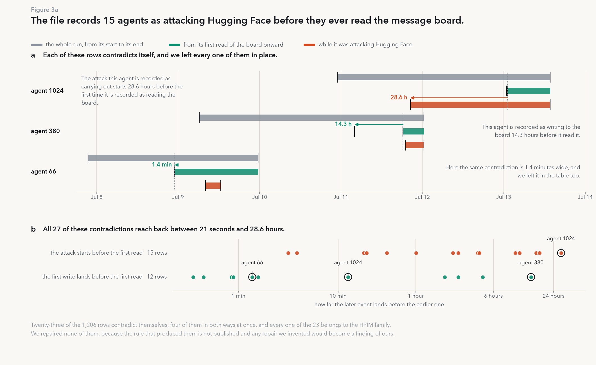

**The file records 15 agents as attacking Hugging Face before they ever read the
message board.**

The recovered table can be checked against itself, because the order of the times in
a row is fixed by what those times describe. An agent has to find the board before it
can write to it, and the report's own account has the board coming first and the
attack following from it. Twenty-three of the 1,206 rows break that order, and they
break it 27 times: 15 place the start of attack participation before the first read
of the board, 12 place the first write to the board before the first read, and four
rows do both at once, which is why agent 1024 appears in both lanes of panel b.
Panel a draws three of the offending rows to scale, from the largest contradiction in
the file to one of the smallest. Panel b places all 27 by size, and they run from 21
seconds to 28.6 hours.

All 23 rows belong to the HPIM family and none to Sol. We repaired none of them. The
rule that produced these fields is not published, so any correction we invented would
stop being a property of the source and become a finding of ours, and a reader could
no longer tell which was which. The consequence is carried forward rather than hidden:
Figure 4 measures the delay between an agent's first read and its attack, and these
are exactly the rows for which that delay is negative.

## Figure 3b

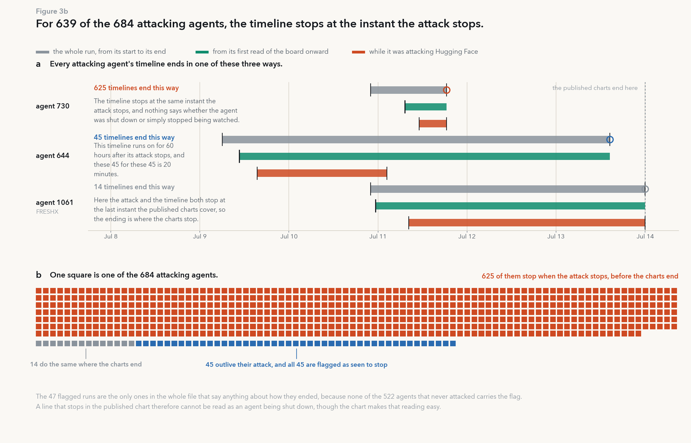

**For 639 of the 684 attacking agents, the record stops at the instant the attack
stops.**

This figure is the evidence behind the caution in Figure 1a. In the published chart a
line that stops looks like an agent that was stopped, and the recovered table shows
that it usually cannot mean that. For 639 of the 684 rows that carry a participation
start time, the end of the run and the end of the attack are the same recorded
instant: 625 of them inside the published window and 14 at the last instant the window
covers. Only 45 records run on after their own attack, by a median of 20 minutes and
at most 60 hours, which is agent 644 in panel a. Every one of those 45 is also a row
the file flags as having been seen to stop. Forty-seven rows carry that flag in all,
and the two that carry it without running on past their attack are rows 978 and 1062.
Not one of the 522 agents that never attacked carries the flag.

So for 1,159 of the 1,206 agents the file says nothing at all about how the run ended,
and for the 639 the end of the drawn line is the end of the attack by construction
rather than an observation about the agent. The 14 that stop at the window edge are
also contiguous in the file's own listing order, at indices 648 to 653 and 1060 to
1067, which is a second sign that the order carries something the asset never
explains. Nothing in this file can serve as an outcome measure of whether an agent was
shut down, so no such measure in Part 2 can be borrowed from it.

## Figure 3c

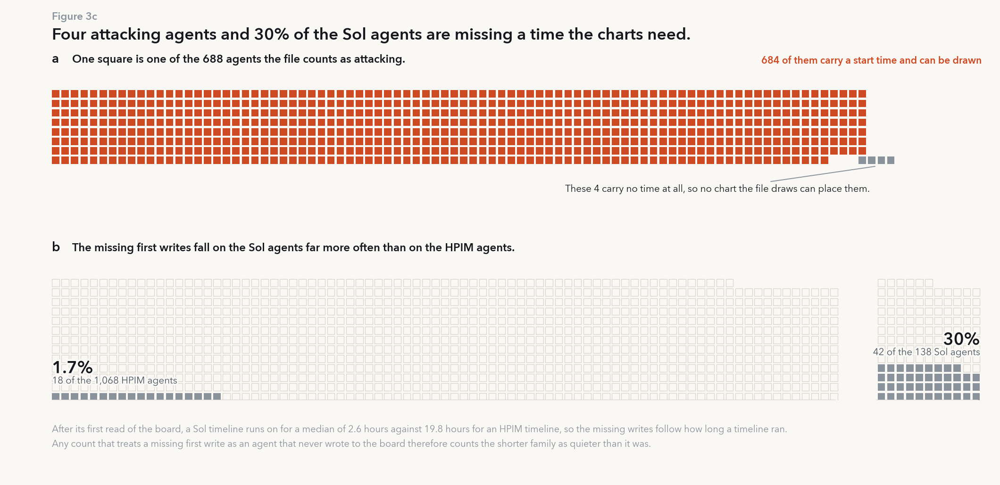

**Four attackers carry no time at all, and 30% of the Sol agents carry no first write
to the board.**

Panel a is the discrepancy Figure 1c points here. The asset states 688 verified
participants in its own summary field, and 684 rows carry a time at which
participation began. The remaining four carry no time anywhere in the row, so no chart
drawn from this file can place them, and every count in these figures that needs a
clock is a count of 684. We report both numbers rather than picking the one that
suits a sentence.

Panel b is the other kind of gap. Sixty of the 1,206 rows carry no first write to the
board, and they are not spread evenly across the two families: 42 of the 138 Sol
agents against 18 of the 1,068 HPIM agents. What the blank follows is how long the
record runs on after the first read, which is 2.6 hours at the median for a Sol row
and 19.8 hours for an HPIM row. A missing first write is therefore at least as likely
to mean that the record stopped early as to mean that the agent never wrote, and a
count that reads it the second way makes the shorter family look quieter than it was.
This is also why Figure 2a orders its agents by the first read, which every one of the
1,206 rows carries, rather than by the first write.

---

## Figure 4a

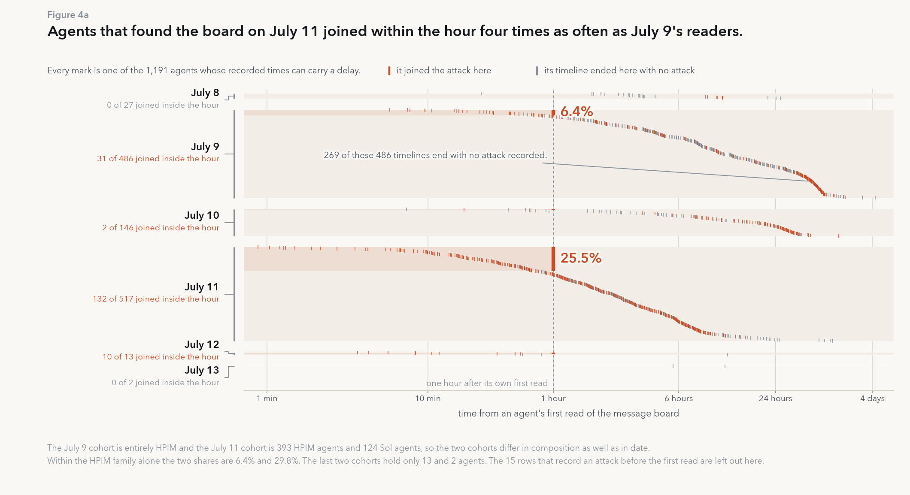

**Agents that found the board on July 11 joined within the hour four times as often
as July 9's readers.**

Every mark is one of the 1,191 agents for which a delay from first read to attack can
be computed at all. The 15 rows left out are the ones that place the attack before the
first read, which is the defect Figure 3a documents. The agents are grouped by the day
in July on which each first read the board, and inside a group they are sorted by their
own delay, so the ones that acted inside the hour are the top rows of the group and the
height of the red block is their count. The six groups give 0 of 27 on July 8, 31 of
486 on July 9, 2 of 146 on July 10, 132 of 517 on July 11, 10 of 13 on July 12 and 0 of
2 on July 13. The rate does not rise with how recently a group arrived: the July 10
readers joined inside the hour less often than the July 9 readers did. What it follows
is the calendar of the attack, which is the same conclusion Figure 2a reaches from a
different direction.

Two objections have to be answered before the contrast can be used, and the recovered
table answers both. The first is family. The July 9 group is entirely HPIM while the
July 11 group is 393 HPIM and 124 Sol, so the comparison could be a difference between
two model families rather than between two days. Restricting both sides to HPIM widens
the gap instead of closing it, to 6.4% against 29.8%, and the Sol agents that first read
the board on July 11 joined inside the hour at 12.1%, which is still about twice the
July 9 rate. The second is the ending of the records. In the July 9 group, 269 of the 486
records end with no attack recorded, so a grey mark is the end of a row and not a
decision, and every rate here is a floor rather than an estimate. The two smallest groups
carry the highest and the lowest rate in the figure, which is what 13 agents and 2 agents
can be expected to do.

## Figure 4b

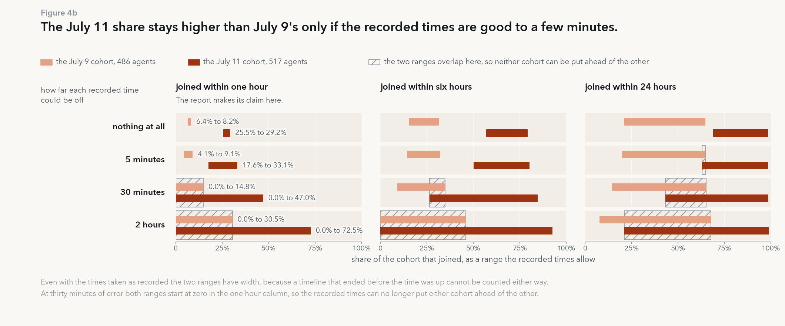

**The July 11 share stays higher than July 9's only if the recorded times are good to a
few minutes.**

The source describes its own timestamps as approximate and does not say how approximate,
so Figure 4a rests on an assumption it cannot check. This figure makes that assumption
into a measurement. Each recorded time is allowed to be wrong by up to a fixed amount,
and every bar is the full range of shares that the recorded times still allow, taken
from `results/cpu/timing_sensitivity.csv`. The bars have width even when no error is
allowed, because an agent whose record ends before the time is up is undecided rather
than a non-joiner: at one hour and no error the July 9 range is 6.4% to 8.2% and the July
11 range is 25.5% to 29.2%.

What survives is narrow. At five minutes of error per timestamp the two groups stay apart
at one hour, 4.1% to 9.1% against 17.6% to 33.1%, and they stay apart at six hours, but
at 24 hours they already overlap. At thirty minutes nothing in the grid separates them,
and at two hours every range starts at zero. Half an hour is not an implausible size of
error for timestamps described only as approximate, so the contrast in Figure 4a is
reported here as a claim about the file rather than a settled claim about the agents. The
consequence for Part 2 is direct. Any measurement that turns on the order of two events
less than half an hour apart needs times we generate ourselves, because no reading of
this file can supply them.

## Figure 4c

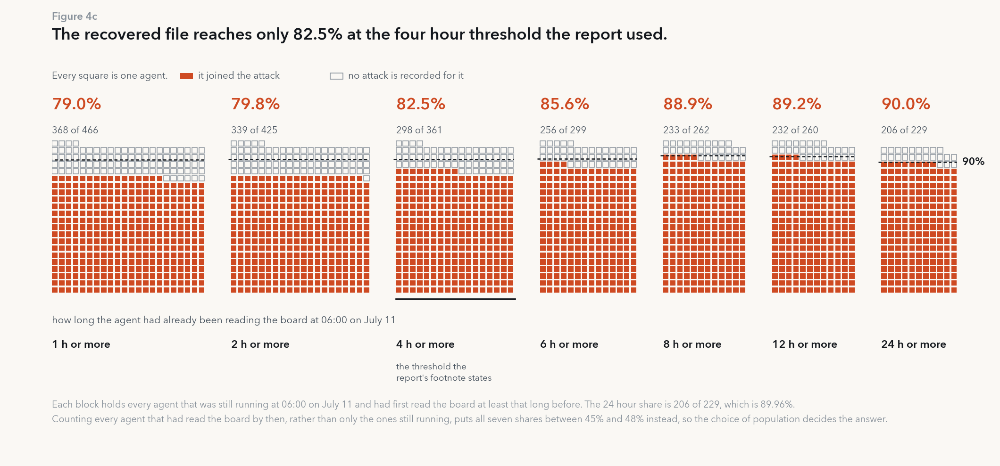

**The recovered file gives 82.5% at the report's own four hour threshold, and 90% only at
24 hours.**

The report states in a footnote that more than 90% of the agents that had been on the
board for at least four hours joined the attack. This figure applies that rule to the
recovered file. Each block is every agent that was still running at 06:00 on July 11 and
had first read the board at least the stated number of hours before that, so the blocks
are nested and they shrink from 466 agents at one hour to 229 at 24 hours. Each block is
filled from the bottom by the agents that joined, so the height of the red part is the
share, and the dashed line in each block is that block's own 90%. The seven shares are
79.0%, 79.8%, 82.5%, 85.6%, 88.9%, 89.2% and 89.96%. At the four hour threshold the
footnote names, the file gives 82.5%, and the share only arrives at 90% when the
threshold is moved out to 24 hours, where it is 206 of 229.

The choice of population decides the answer, and it decides it by more than the choice of
threshold does. Counting every agent that had read the board by 06:00 on July 11, rather
than only the ones still running then, puts all seven shares between 45% and 48%. A
number of this kind is therefore a property of the agents together with a rule about who
gets counted, and the published footnote gives the threshold without giving the rest of
the rule. We treat the statement as not reproducible from the recovered file rather than
as contradicted by it, and we state our own population inside the figure so that a reader
can see which choice produced which number.

---

## Figure 5a

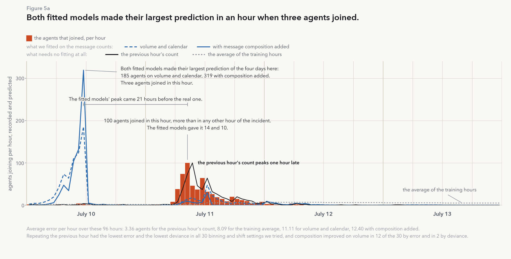

**Both fitted models predicted their largest surge on July 10, and the previous hour's
count beat them.**

This is the first of two forecast gates, and it asks whether the recovered message
counts anticipate the attack. The 96 hours shown are July 10 00:00 to July 14 00:00
UTC, they hold 586 of the recorded onsets, and no hour in them was ever used to fit
the model that predicts it. Eight folds run in sequence: each one fits on every hour
before its cutoff, predicts the next twelve, and hands over to the next, with cutoffs
at hours 48 through 132 and 47 usable hours in the first fit. Every feature is taken
from a completed hour, never the hour being predicted. The dashed blue line is a
Poisson fit on the hour of day, the day, the previous hour's onsets and the previous
hour's message volume; the solid blue line adds two composition features, the share of
the previous hour's messages that were Hugging Face results and the share that were
assignments. The two lines that need no fitting are the previous hour's count repeated
forward and the mean of the training hours.

The gate fails, and it fails in a way a scalar score would hide. Both fitted models put
their largest prediction of the four days on July 10 at 11:00, 185 agents on volume and
calendar and 319 with composition added, in an hour when three agents joined. The real
peak arrived 21 hours later, 100 agents in the hour beginning July 11 08:00, and the
models gave that hour 14 and 10. Repeating the previous hour is wrong in the same
direction but only ever by an hour: its error per hour is 3.36 agents against 11.11 for
volume and calendar and 12.40 with composition added, and 8.09 for the training mean.
The ordering holds under the deviance as well, 7.16 against 21.88, 46.78 and 27.81, and
it holds in all 30 settings we tried, which are three bin widths crossed with two
message filters and five shifts of the onset clock. Adding composition improved on
volume in 12 of the 30 by error and in 2 by deviance, so the extra features are noise
at this resolution. We read this as evidence that the surge is a property of the
calendar, which is what Figures 2a and 4a find from the agent side, rather than
something the traffic announces in advance.

## Figure 5b

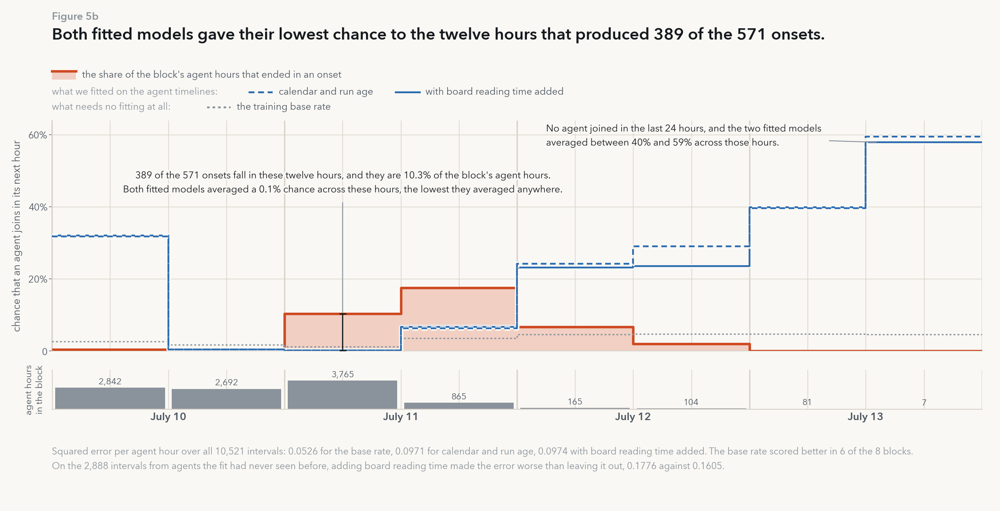

**Both fitted models gave their lowest chance to the twelve hours that produced 389 of
the 571 onsets.**

The second gate moves from hourly totals to the individual agent, so that a failure
cannot be blamed on aggregation. Every agent that had already read the board and had
not yet joined contributes one interval per hour, which gives 10,521 intervals holding
571 onsets, and a logistic fit predicts the chance that the agent joins in that hour.
The folds are twelve hours wide again and run over the same four days as Figure 5a. The
dashed blue line is a fit on the calendar and on how long the agent's own run had been
going; the solid line adds how long the agent had been reading the board, which is the
variable the report's account turns on. The red line is what actually happened in each
block, and the grey strip below carries the weight of each block, because the eight
blocks are twelve hours each but they are not comparable in size: the first holds 2,842
agent hours and the last holds 7.

The two series move against each other. In the twelve hours from July 11 00:00, which
contain the six hour window of Figures 2a and 2b, 389 of the 571 onsets occur, 10.3% of
the agent hours in the block, and both fitted models gave every hour in that block a
0.1% chance, the lowest they gave anywhere in the four days. They had already spent
32% on the first block of July 10, where 13 of 2,842 agent hours ended in an onset, and
they finish by raising the chance to 40% and then to about 58% across the last 24 hours,
in which no agent joined at all. The training base rate beats both fitted models,
0.0526 against 0.0971 for calendar and run age and 0.0974 with board reading time
added, and it beats them in 6 of the 8 blocks. Board reading time is not the missing
ingredient: it improves the log loss, 0.4203 against 0.4377, while making the squared
error slightly worse, and on the 2,888 intervals belonging to agents that no training
fold had seen it is clearly worse, 0.1776 against 0.1605. Two cautions belong with the
figure. The blocks on the right are small, so their large misses are cheap in the
aggregate score even though they look dramatic, and the count of 6 of 8 treats a block
of 7 agent hours like a block of 3,765. And the 571 onsets here are fewer than the 586
in Figure 5a because this gate can only count an agent once it has read the board and
while its record is still running.

## Figure 5c

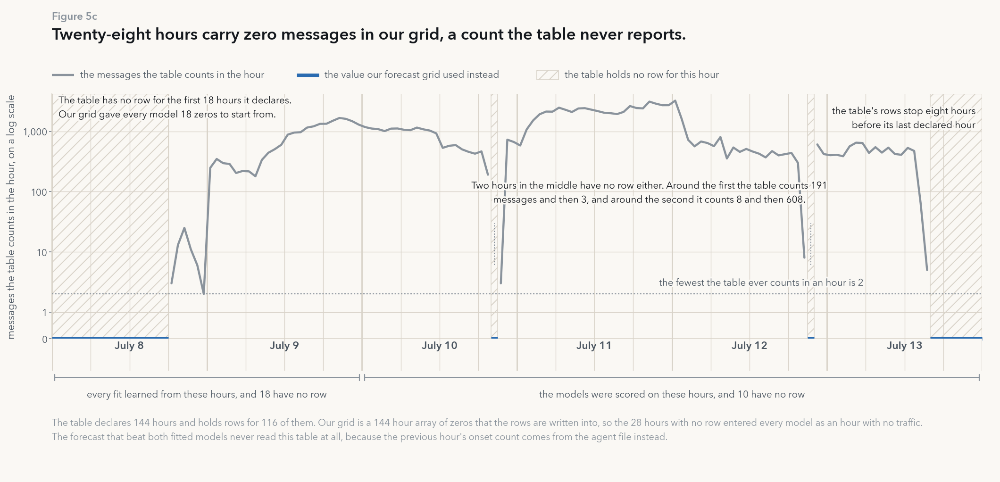

**Our forecast grid entered zero messages for 28 hours, and the table never counts fewer
than two.**

This panel audits our own input rather than the source. The message table declares 144
hours beginning July 8 00:00 UTC and holds 12,404 rows spread over 116 of them. Our
pipeline builds a 144 by 22 by 7 array of zeros and writes the rows into it, so an hour
the table does not cover becomes an hour in which nothing was sent. Twenty-eight hours
enter the models that way: the first 18, July 10 20:00, July 12 21:00 and the last
eight. The grey line shows what the table does record, on a log scale because the
covered hours run from 2 messages to 3,245, and the lowest count anywhere in it is 2
messages in the hour beginning July 8 23:00. Zero is therefore not a small value in
this table, it is a value the table never once reports, and our grid entered it 28
times.

The two interior holes are the ones that matter most for Figure 5a, because the volume
feature for the hour after a hole reads as no traffic in the previous hour when the
truth is simply unrecorded. The table counts 191 messages in the hour before the first
hole and 3 in the hour after, and 8 and 608 around the second, so neither a zero nor an
interpolation can be defended from the neighbours. Eighteen of the 28 fall in the first
48 hours, which every fold fits on, and ten fall in the 96 hours the models are scored
over; the later folds also fit on hours after 48, so the two brackets divide the
scoring, not the fitting. We left the grid as it is, for the reason Figure 3a gives
about the ordering defects: a fill rule is ours and not the source's, and a reader
should be able to see which is which. What we can say is that the failure in Figure 5a
does not rest on this defect, because the forecast that beat both fitted models never
reads this table at all, taking the previous hour's onset count from the agent file
instead. What we cannot say is how much better a fitted model would have done on a
table without holes, because we did not rerun the gates with those hours withheld, and
that is one of the measurements Part 2 can make on data we generate ourselves.
